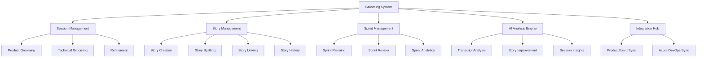
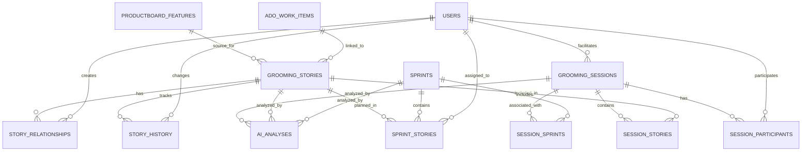
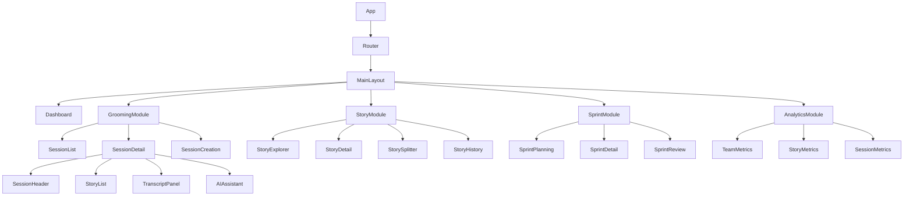
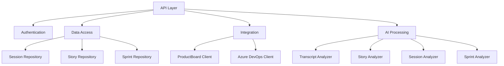
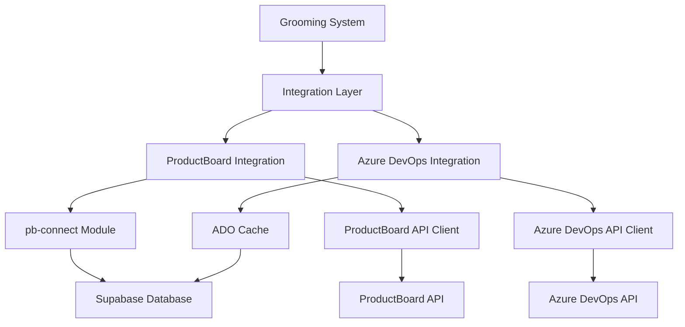
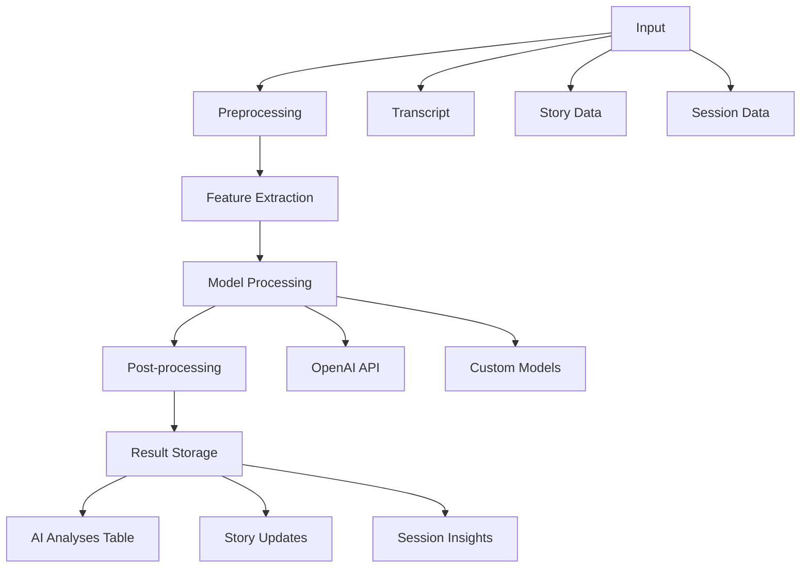
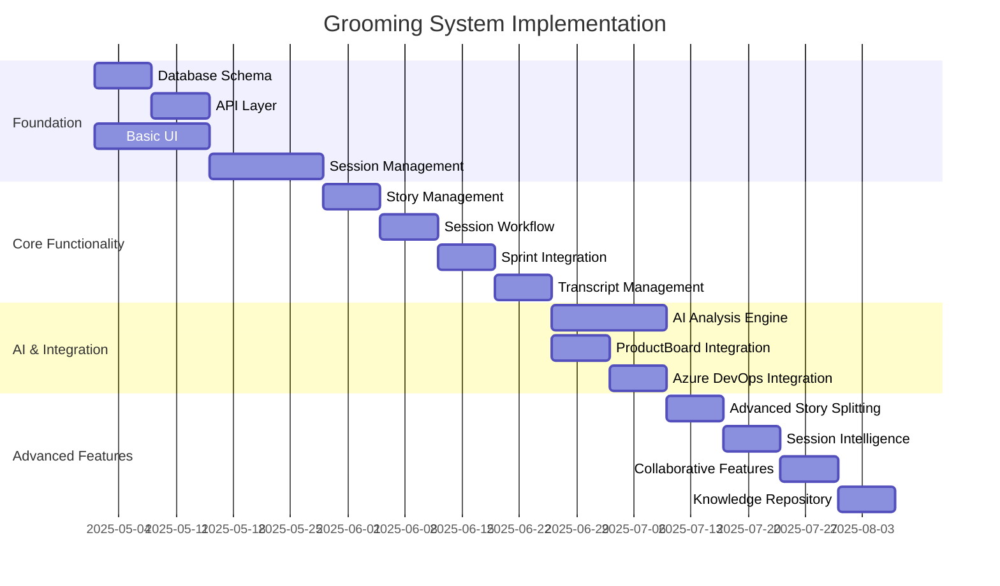
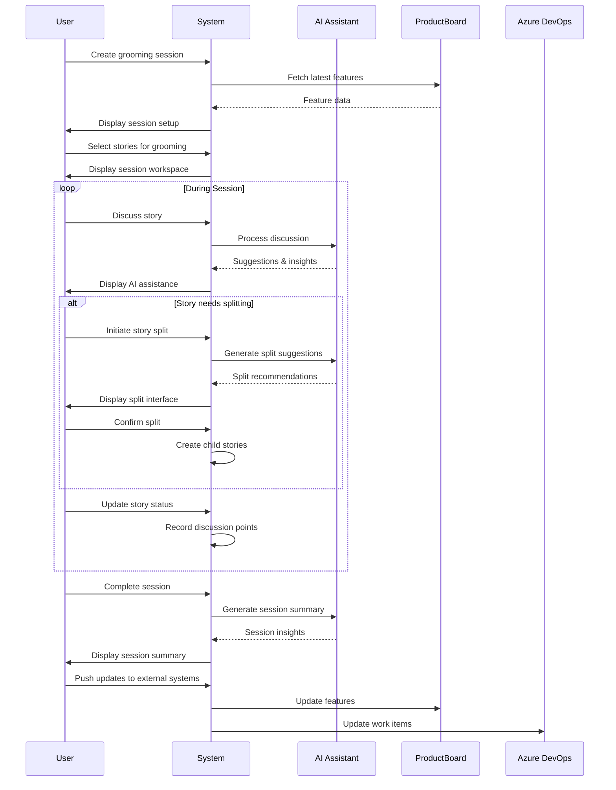
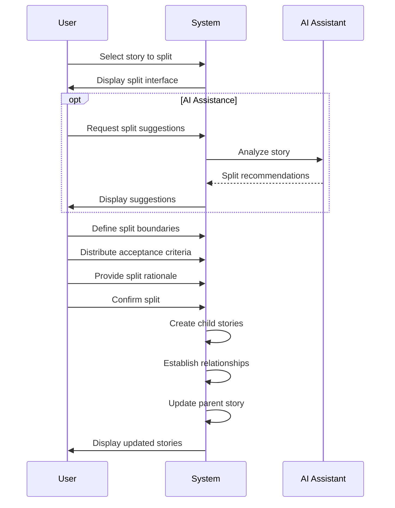
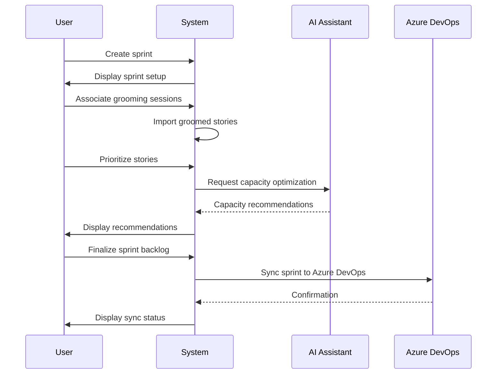

# Advanced Grooming System: Architecture & Implementation Plan

## Table of Contents

1. [System Overview](#system-overview)
2. [Database Schema](#database-schema)
3. [Component Architecture](#component-architecture)
4. [Integration Points](#integration-points)
5. [AI Capabilities](#ai-capabilities)
6. [Implementation Roadmap](#implementation-roadmap)
7. [Technical Specifications](#technical-specifications)
8. [User Workflows](#user-workflows)
9. [Appendix: Database Migrations](#appendix-database-migrations)

## System Overview

The Advanced Grooming System is a comprehensive solution designed to enhance the agile grooming process by providing sophisticated story management, cross-session continuity, and AI-powered analysis. The system integrates with both ProductBoard and Azure DevOps to create a seamless workflow from product planning to development execution.

### Core Capabilities

- **Multi-type Session Management**: Support for product, technical, and refinement grooming sessions
- **Advanced Story Management**: Story splitting, linking, and cross-session tracking
- **Sprint Integration**: Connect grooming sessions to sprints for end-to-end planning
- **Transcript Analysis**: Upload and analyze meeting transcripts for insights
- **AI-Powered Assistance**: Intelligent suggestions for story improvement and session insights
- **Bi-directional Integration**: Sync with ProductBoard and Azure DevOps

### System Architecture Diagram



## Database Schema

The database schema is designed to support all aspects of the grooming system while maintaining relationships with existing ProductBoard and Azure DevOps data.

### Existing Tables

The system will integrate with the following existing tables:

| Table Name | Description | Relevant Fields |
|------------|-------------|-----------------|
| `productboard_features` | Features from ProductBoard | id, title, description, owner_email, metadata |
| `productboard_initiatives` | Initiatives from ProductBoard | id, name, description |
| `productboard_components` | Components from ProductBoard | id, name, description |
| `productboard_users` | Users from ProductBoard | id, email, name |
| `productboard_products` | Products from ProductBoard | id, name, description |
| `ado_work_items` | Work items from Azure DevOps | id, title, type, state, area_path |
| `ado_teams` | Teams from Azure DevOps | id, name |
| `hierarchy_mappings` | Mappings between PB and ADO hierarchies | id, name, pb_to_ado_mappings, area_path_mappings |

### New Tables

The following new tables will be created to support the grooming system:

#### Core Tables

```sql
-- Grooming sessions
CREATE TABLE grooming_sessions (
  id UUID PRIMARY KEY DEFAULT uuid_generate_v4(),
  name TEXT NOT NULL,
  session_type TEXT NOT NULL CHECK (session_type IN ('product', 'technical', 'refinement')),
  session_date TIMESTAMP WITH TIME ZONE NOT NULL,
  duration_minutes INTEGER NOT NULL,
  status TEXT NOT NULL CHECK (status IN ('planned', 'in_progress', 'completed')),
  workspace_id UUID NOT NULL REFERENCES workspaces(id) ON DELETE CASCADE,
  facilitator_id UUID REFERENCES auth.users(id),
  transcript TEXT,
  transcript_uploaded_at TIMESTAMP WITH TIME ZONE,
  created_at TIMESTAMP WITH TIME ZONE DEFAULT NOW(),
  updated_at TIMESTAMP WITH TIME ZONE DEFAULT NOW()
);

-- Stories (extends productboard_features with grooming-specific data)
CREATE TABLE grooming_stories (
  id UUID PRIMARY KEY DEFAULT uuid_generate_v4(),
  pb_feature_id TEXT REFERENCES productboard_features(id),
  ado_work_item_id INTEGER REFERENCES ado_work_items(id),
  title TEXT NOT NULL,
  description TEXT,
  acceptance_criteria JSONB DEFAULT '[]'::JSONB,
  level TEXT CHECK (level IN ('epic', 'feature', 'story')),
  status TEXT NOT NULL DEFAULT 'new',
  story_points INTEGER,
  complexity INTEGER,
  business_value INTEGER,
  parent_story_id UUID REFERENCES grooming_stories(id),
  workspace_id UUID NOT NULL REFERENCES workspaces(id) ON DELETE CASCADE,
  created_at TIMESTAMP WITH TIME ZONE DEFAULT NOW(),
  updated_at TIMESTAMP WITH TIME ZONE DEFAULT NOW()
);

-- Session stories (join table between sessions and stories)
CREATE TABLE session_stories (
  id UUID PRIMARY KEY DEFAULT uuid_generate_v4(),
  session_id UUID NOT NULL REFERENCES grooming_sessions(id) ON DELETE CASCADE,
  story_id UUID NOT NULL REFERENCES grooming_stories(id) ON DELETE CASCADE,
  status TEXT NOT NULL DEFAULT 'pending' CHECK (status IN ('pending', 'discussed', 'deferred', 'split', 'rejected')),
  discussion_order INTEGER,
  discussion_points JSONB DEFAULT '[]'::JSONB,
  complexity_rating INTEGER,
  created_at TIMESTAMP WITH TIME ZONE DEFAULT NOW(),
  updated_at TIMESTAMP WITH TIME ZONE DEFAULT NOW(),
  UNIQUE(session_id, story_id)
);

-- Sprints
CREATE TABLE sprints (
  id UUID PRIMARY KEY DEFAULT uuid_generate_v4(),
  name TEXT NOT NULL,
  start_date TIMESTAMP WITH TIME ZONE NOT NULL,
  end_date TIMESTAMP WITH TIME ZONE NOT NULL,
  goal TEXT,
  status TEXT NOT NULL DEFAULT 'planning' CHECK (status IN ('planning', 'active', 'completed')),
  capacity INTEGER,
  workspace_id UUID NOT NULL REFERENCES workspaces(id) ON DELETE CASCADE,
  retrospective_notes TEXT,
  created_at TIMESTAMP WITH TIME ZONE DEFAULT NOW(),
  updated_at TIMESTAMP WITH TIME ZONE DEFAULT NOW()
);

-- Sprint stories (join table between sprints and stories)
CREATE TABLE sprint_stories (
  id UUID PRIMARY KEY DEFAULT uuid_generate_v4(),
  sprint_id UUID NOT NULL REFERENCES sprints(id) ON DELETE CASCADE,
  story_id UUID NOT NULL REFERENCES grooming_stories(id) ON DELETE CASCADE,
  priority INTEGER,
  added_date TIMESTAMP WITH TIME ZONE DEFAULT NOW(),
  status TEXT NOT NULL DEFAULT 'planned' CHECK (status IN ('planned', 'in_progress', 'done')),
  assignee_id UUID REFERENCES auth.users(id),
  created_at TIMESTAMP WITH TIME ZONE DEFAULT NOW(),
  updated_at TIMESTAMP WITH TIME ZONE DEFAULT NOW(),
  UNIQUE(sprint_id, story_id)
);
```

#### Supporting Tables

```sql
-- Story relationships (for tracking splits, dependencies, etc.)
CREATE TABLE story_relationships (
  id UUID PRIMARY KEY DEFAULT uuid_generate_v4(),
  source_story_id UUID NOT NULL REFERENCES grooming_stories(id) ON DELETE CASCADE,
  target_story_id UUID NOT NULL REFERENCES grooming_stories(id) ON DELETE CASCADE,
  relationship_type TEXT NOT NULL CHECK (relationship_type IN ('parent_child', 'split', 'depends_on', 'related_to')),
  created_by UUID REFERENCES auth.users(id),
  created_at TIMESTAMP WITH TIME ZONE DEFAULT NOW(),
  metadata JSONB DEFAULT '{}'::JSONB,
  UNIQUE(source_story_id, target_story_id, relationship_type)
);

-- Story history (for tracking changes to stories)
CREATE TABLE story_history (
  id UUID PRIMARY KEY DEFAULT uuid_generate_v4(),
  story_id UUID NOT NULL REFERENCES grooming_stories(id) ON DELETE CASCADE,
  session_id UUID REFERENCES grooming_sessions(id) ON DELETE SET NULL,
  field_name TEXT NOT NULL,
  old_value TEXT,
  new_value TEXT,
  changed_by UUID REFERENCES auth.users(id),
  changed_at TIMESTAMP WITH TIME ZONE DEFAULT NOW()
);

-- Session participants
CREATE TABLE session_participants (
  id UUID PRIMARY KEY DEFAULT uuid_generate_v4(),
  session_id UUID NOT NULL REFERENCES grooming_sessions(id) ON DELETE CASCADE,
  user_id UUID NOT NULL REFERENCES auth.users(id) ON DELETE CASCADE,
  role TEXT NOT NULL DEFAULT 'participant' CHECK (role IN ('facilitator', 'participant', 'observer')),
  joined_at TIMESTAMP WITH TIME ZONE DEFAULT NOW(),
  UNIQUE(session_id, user_id)
);

-- AI analysis results
CREATE TABLE ai_analyses (
  id UUID PRIMARY KEY DEFAULT uuid_generate_v4(),
  session_id UUID REFERENCES grooming_sessions(id) ON DELETE CASCADE,
  story_id UUID REFERENCES grooming_stories(id) ON DELETE CASCADE,
  sprint_id UUID REFERENCES sprints(id) ON DELETE CASCADE,
  analysis_type TEXT NOT NULL,
  key_points JSONB DEFAULT '[]'::JSONB,
  action_items JSONB DEFAULT '[]'::JSONB,
  decisions JSONB DEFAULT '[]'::JSONB,
  risks JSONB DEFAULT '[]'::JSONB,
  suggestions JSONB DEFAULT '[]'::JSONB,
  sentiment_score FLOAT,
  created_at TIMESTAMP WITH TIME ZONE DEFAULT NOW(),
  raw_analysis JSONB DEFAULT '{}'::JSONB
);

-- Session sprint association
CREATE TABLE session_sprints (
  id UUID PRIMARY KEY DEFAULT uuid_generate_v4(),
  session_id UUID NOT NULL REFERENCES grooming_sessions(id) ON DELETE CASCADE,
  sprint_id UUID NOT NULL REFERENCES sprints(id) ON DELETE CASCADE,
  created_at TIMESTAMP WITH TIME ZONE DEFAULT NOW(),
  UNIQUE(session_id, sprint_id)
);
```

### Entity Relationship Diagram



## Component Architecture

The system is built using a modular component architecture that separates concerns and promotes reusability.

### Frontend Architecture



### Backend Architecture



## Integration Points

The system integrates with both ProductBoard and Azure DevOps to provide a seamless workflow.

### ProductBoard Integration

| Integration Point | Direction | Description | Implementation |
|-------------------|-----------|-------------|----------------|
| Feature Import | PB → System | Import features as stories | Scheduled sync using existing `pb-connect` module |
| Initiative Import | PB → System | Import initiatives for epic mapping | Scheduled sync using existing `pb-connect` module |
| Component Import | PB → System | Import components for feature categorization | Scheduled sync using existing `pb-connect` module |
| User Import | PB → System | Import users for assignment | Scheduled sync using existing `pb-connect` module |
| Story Updates | System → PB | Push story updates back to ProductBoard | API calls via `productBoard.ts` |
| Prioritization | System → PB | Push prioritization from grooming to ProductBoard | API calls via `productBoard.ts` |

### Azure DevOps Integration

| Integration Point | Direction | Description | Implementation |
|-------------------|-----------|-------------|----------------|
| Work Item Import | ADO → System | Import work items as stories | Scheduled sync using existing ADO cache |
| Team Import | ADO → System | Import teams for assignment | Scheduled sync using existing ADO cache |
| Work Item Updates | System → ADO | Push story updates to ADO work items | API calls via `azureDevOps.ts` |
| Sprint Sync | Bi-directional | Sync sprint information | API calls via `azureDevOps.ts` |
| Backlog Order | System → ADO | Push prioritization to ADO backlog | API calls via `azureDevOps.ts` |

### Integration Architecture



## AI Capabilities

The system leverages AI to provide intelligent assistance throughout the grooming process.

### Transcript Analysis

The system can analyze meeting transcripts to extract key information:

1. **Upload & Processing**:
   - Support for text and audio transcripts
   - Automatic speech-to-text conversion
   - Transcript segmentation and speaker identification

2. **Information Extraction**:
   - Key point identification
   - Action item extraction
   - Decision recognition
   - Risk identification

3. **Implementation**:
   - Supabase Edge Function for processing
   - OpenAI API integration
   - Custom NLP pipeline

### Story Enhancement

AI-powered story improvement suggestions:

1. **Quality Assessment**:
   - Acceptance criteria completeness
   - Description clarity
   - Testability evaluation
   - Independence verification

2. **Improvement Suggestions**:
   - Acceptance criteria refinement
   - Description enhancement
   - Edge case identification
   - Dependency recognition

3. **Implementation**:
   - Story analysis service
   - Historical pattern recognition
   - Team-specific learning application

### Session Intelligence

AI insights for grooming sessions:

1. **Real-time Assistance**:
   - Discussion facilitation
   - Question prompting
   - Information gap identification
   - Time management suggestions

2. **Post-session Analysis**:
   - Session effectiveness evaluation
   - Participation balance assessment
   - Decision quality analysis
   - Follow-up recommendation

3. **Implementation**:
   - Real-time analysis service
   - Session metrics calculation
   - Historical comparison engine

### AI Processing Pipeline



## Implementation Roadmap

The implementation is divided into four phases, each building on the previous one.

### Phase 1: Foundation (Weeks 1-4)

| Week | Focus | Tasks | Dependencies |
|------|-------|-------|--------------|
| 1 | Database Setup | Create database schema, Set up migrations | None |
| 2 | API Layer | Implement data access layer, Set up authentication | Database Schema |
| 3 | Basic UI | Create core UI components, Implement layouts | None |
| 4 | Session Management | Implement basic session CRUD, Session type handling | API Layer, Basic UI |

### Phase 2: Core Functionality (Weeks 5-8)

| Week | Focus | Tasks | Dependencies |
|------|-------|-------|--------------|
| 5 | Story Management | Story CRUD, Story selection, Basic splitting | Phase 1 |
| 6 | Session Workflow | Session preparation, In-session management | Story Management |
| 7 | Sprint Integration | Sprint CRUD, Session-sprint association | Session Workflow |
| 8 | Transcript Management | Transcript upload, Basic parsing | Session Workflow |

### Phase 3: AI & Integration (Weeks 9-12)

| Week | Focus | Tasks | Dependencies |
|------|-------|-------|--------------|
| 9-10 | AI Analysis Engine | Transcript analysis, Story improvement, Session insights | Phase 2 |
| 11 | ProductBoard Integration | Feature sync, Initiative sync, Prioritization | Phase 2 |
| 12 | Azure DevOps Integration | Work item sync, Sprint sync, Backlog order | Phase 2 |

### Phase 4: Advanced Features (Weeks 13-16)

| Week | Focus | Tasks | Dependencies |
|------|-------|-------|--------------|
| 13 | Advanced Story Splitting | Visual split editor, Split tracking, AI suggestions | Phase 3 |
| 14 | Session Intelligence | Pattern recognition, Team analytics, Quality metrics | Phase 3 |
| 15 | Collaborative Features | Real-time editing, Voting tools, Remote participation | Phase 3 |
| 16 | Knowledge Repository | Decision database, Learning categorization, Best practices | Phase 3 |

### Implementation Timeline



## Technical Specifications

### Frontend Stack

- **Framework**: React with TypeScript
- **State Management**: React Query + Context API
- **UI Components**: Shadcn UI + Custom components
- **Form Handling**: React Hook Form + Zod validation
- **Routing**: React Router
- **API Client**: Axios + custom request hooks

### Backend Stack

- **Database**: PostgreSQL via Supabase
- **Authentication**: Supabase Auth
- **Storage**: Supabase Storage
- **Serverless Functions**: Supabase Edge Functions
- **API**: RESTful endpoints + RPC functions

### AI Integration

- **Primary AI Provider**: OpenAI
- **API Integration**: GPT-4 for analysis, DALL-E for visualization
- **Custom Models**: Fine-tuned models for domain-specific tasks
- **Processing Pipeline**: Serverless functions for preprocessing and postprocessing

### Development Tools

- **Build System**: Vite
- **Testing**: Vitest + React Testing Library
- **CI/CD**: GitHub Actions
- **Code Quality**: ESLint + Prettier
- **Documentation**: Storybook + Markdown

## User Workflows

### Grooming Session Workflow



### Story Splitting Workflow



### Sprint Planning Workflow



## Appendix: Database Migrations

### Migration 0010: Create Grooming System Tables

```sql
-- Migration file: supabase/migrations/0010_create_grooming_system_tables.sql

-- Enable UUID generation
CREATE EXTENSION IF NOT EXISTS "uuid-ossp";

-- Grooming sessions
CREATE TABLE grooming_sessions (
  id UUID PRIMARY KEY DEFAULT uuid_generate_v4(),
  name TEXT NOT NULL,
  session_type TEXT NOT NULL CHECK (session_type IN ('product', 'technical', 'refinement')),
  session_date TIMESTAMP WITH TIME ZONE NOT NULL,
  duration_minutes INTEGER NOT NULL,
  status TEXT NOT NULL CHECK (status IN ('planned', 'in_progress', 'completed')),
  workspace_id UUID NOT NULL REFERENCES workspaces(id) ON DELETE CASCADE,
  facilitator_id UUID REFERENCES auth.users(id),
  transcript TEXT,
  transcript_uploaded_at TIMESTAMP WITH TIME ZONE,
  created_at TIMESTAMP WITH TIME ZONE DEFAULT NOW(),
  updated_at TIMESTAMP WITH TIME ZONE DEFAULT NOW()
);

-- Stories (extends productboard_features with grooming-specific data)
CREATE TABLE grooming_stories (
  id UUID PRIMARY KEY DEFAULT uuid_generate_v4(),
  pb_feature_id TEXT REFERENCES productboard_features(id),
  ado_work_item_id INTEGER REFERENCES ado_work_items(id),
  title TEXT NOT NULL,
  description TEXT,
  acceptance_criteria JSONB DEFAULT '[]'::JSONB,
  level TEXT CHECK (level IN ('epic', 'feature', 'story')),
  status TEXT NOT NULL DEFAULT 'new',
  story_points INTEGER,
  complexity INTEGER,
  business_value INTEGER,
  parent_story_id UUID REFERENCES grooming_stories(id),
  workspace_id UUID NOT NULL REFERENCES workspaces(id) ON DELETE CASCADE,
  created_at TIMESTAMP WITH TIME ZONE DEFAULT NOW(),
  updated_at TIMESTAMP WITH TIME ZONE DEFAULT NOW()
);

-- Session stories (join table between sessions and stories)
CREATE TABLE session_stories (
  id UUID PRIMARY KEY DEFAULT uuid_generate_v4(),
  session_id UUID NOT NULL REFERENCES grooming_sessions(id) ON DELETE CASCADE,
  story_id UUID NOT NULL REFERENCES grooming_stories(id) ON DELETE CASCADE,
  status TEXT NOT NULL DEFAULT 'pending' CHECK (status IN ('pending', 'discussed', 'deferred', 'split', 'rejected')),
  discussion_order INTEGER,
  discussion_points JSONB DEFAULT '[]'::JSONB,
  complexity_rating INTEGER,
  created_at TIMESTAMP WITH TIME ZONE DEFAULT NOW(),
  updated_at TIMESTAMP WITH TIME ZONE DEFAULT NOW(),
  UNIQUE(session_id, story_id)
);

-- Sprints
CREATE TABLE sprints (
  id UUID PRIMARY KEY DEFAULT uuid_generate_v4(),
  name TEXT NOT NULL,
  start_date TIMESTAMP WITH TIME ZONE NOT NULL,
  end_date TIMESTAMP WITH TIME ZONE NOT NULL,
  goal TEXT,
  status TEXT NOT NULL DEFAULT 'planning' CHECK (status IN ('planning', 'active', 'completed')),
  capacity INTEGER,
  workspace_id UUID NOT NULL REFERENCES workspaces(id) ON DELETE CASCADE,
  retrospective_notes TEXT,
  created_at TIMESTAMP WITH TIME ZONE DEFAULT NOW(),
  updated_at TIMESTAMP WITH TIME ZONE DEFAULT NOW()
);

-- Sprint stories (join table between sprints and stories)
CREATE TABLE sprint_stories (
  id UUID PRIMARY KEY DEFAULT uuid_generate_v4(),
  sprint_id UUID NOT NULL REFERENCES sprints(id) ON DELETE CASCADE,
  story_id UUID NOT NULL REFERENCES grooming_stories(id) ON DELETE CASCADE,
  priority INTEGER,
  added_date TIMESTAMP WITH TIME ZONE DEFAULT NOW(),
  status TEXT NOT NULL DEFAULT 'planned' CHECK (status IN ('planned', 'in_progress', 'done')),
  assignee_id UUID REFERENCES auth.users(id),
  created_at TIMESTAMP WITH TIME ZONE DEFAULT NOW(),
  updated_at TIMESTAMP WITH TIME ZONE DEFAULT NOW(),
  UNIQUE(sprint_id, story_id)
);

-- Story relationships (for tracking splits, dependencies, etc.)
CREATE TABLE story_relationships (
  id UUID PRIMARY KEY DEFAULT uuid_generate_v4(),
  source_story_id UUID NOT NULL REFERENCES grooming_stories(id) ON DELETE CASCADE,
  target_story_id UUID NOT NULL REFERENCES grooming_stories(id) ON DELETE CASCADE,
  relationship_type TEXT NOT NULL CHECK (relationship_type IN ('parent_child', 'split', 'depends_on', 'related_to')),
  created_by UUID REFERENCES auth.users(id),
  created_at TIMESTAMP WITH TIME ZONE DEFAULT NOW(),
  metadata JSONB DEFAULT '{}'::JSONB,
  UNIQUE(source_story_id, target_story_id, relationship_type)
);

-- Story history (for tracking changes to stories)
CREATE TABLE story_history (
  id UUID PRIMARY KEY DEFAULT uuid_generate_v4(),
  story_id UUID NOT NULL REFERENCES grooming_stories(id) ON DELETE CASCADE,
  session_id UUID REFERENCES grooming_sessions(id) ON DELETE SET NULL,
  field_name TEXT NOT NULL,
  old_value TEXT,
  new_value TEXT,
  changed_by UUID REFERENCES auth.users(id),
  changed_at TIMESTAMP WITH TIME ZONE DEFAULT NOW()
);

-- Session participants
CREATE TABLE session_participants (
  id UUID PRIMARY KEY DEFAULT uuid_generate_v4(),
  session_id UUID NOT NULL REFERENCES grooming_sessions(id) ON DELETE CASCADE,
  user_id UUID NOT NULL REFERENCES auth.users(id) ON DELETE CASCADE,
  role TEXT NOT NULL DEFAULT 'participant' CHECK (role IN ('facilitator', 'participant', 'observer')),
  joined_at TIMESTAMP WITH TIME ZONE DEFAULT NOW(),
  UNIQUE(session_id, user_id)
);

-- AI analysis results
CREATE TABLE ai_analyses (
  id UUID PRIMARY KEY DEFAULT uuid_generate_v4(),
  session_id UUID REFERENCES grooming_sessions(id) ON DELETE CASCADE,
  story_id UUID REFERENCES grooming_stories(id) ON DELETE CASCADE,
  sprint_id UUID REFERENCES sprints(id) ON DELETE CASCADE,
  analysis_type TEXT NOT NULL,
  key_points JSONB DEFAULT '[]'::JSONB,
  action_items JSONB DEFAULT '[]'::JSONB,
  decisions JSONB DEFAULT '[]'::JSONB,
  risks JSONB DEFAULT '[]'::JSONB,
  suggestions JSONB DEFAULT '[]'::JSONB,
  sentiment_score FLOAT,
  created_at TIMESTAMP WITH TIME ZONE DEFAULT NOW(),
  raw_analysis JSONB DEFAULT '{}'::JSONB
);

-- Session sprint association
CREATE TABLE session_sprints (
  id UUID PRIMARY KEY DEFAULT uuid_generate_v4(),
  session_id UUID NOT NULL REFERENCES grooming_sessions(id) ON DELETE CASCADE,
  sprint_id UUID NOT NULL REFERENCES sprints(id) ON DELETE CASCADE,
  created_at TIMESTAMP WITH TIME ZONE DEFAULT NOW(),
  UNIQUE(session_id, sprint_id)
);

-- Create indexes for performance
CREATE INDEX idx_grooming_stories_pb_feature_id ON grooming_stories(pb_feature_id);
CREATE INDEX idx_grooming_stories_ado_work_item_id ON grooming_stories(ado_work_item_i
