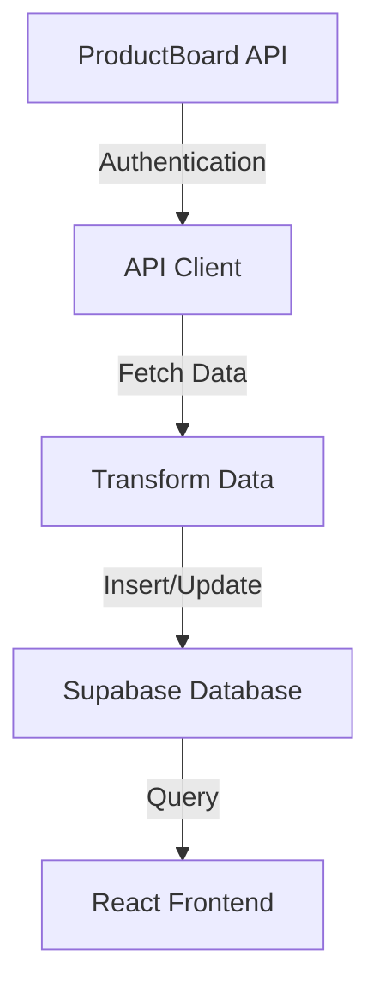
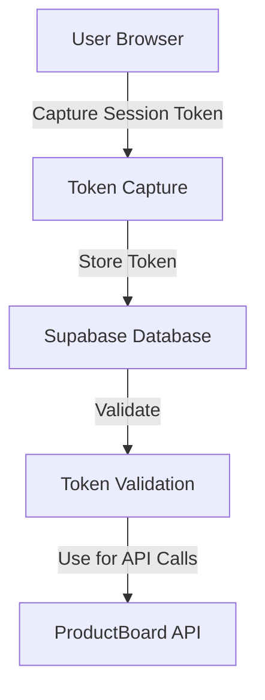
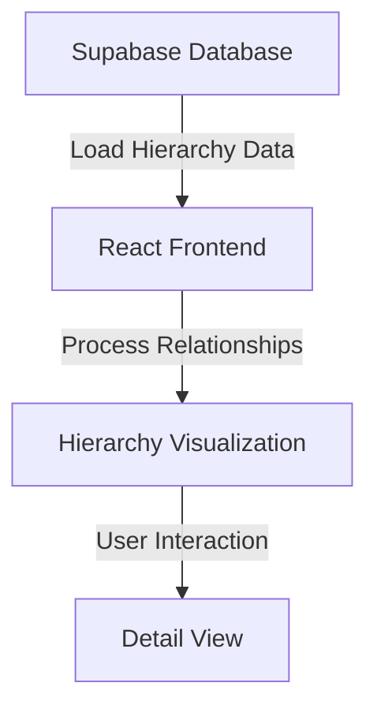

# ProductBoard Integration - Detailed Project Summary

This document provides a comprehensive overview of the cleaned-up project structure, core components, and essential functionality.

## Architecture Overview

This application integrates ProductBoard data with a React frontend and Supabase backend. The system consists of several key components:

1. **React Frontend** - User interface for visualizing and interacting with ProductBoard data
2. **Supabase Backend** - Serverless database and functions for storing and processing data
3. **ProductBoard API Integration** - Core connector for syncing data from ProductBoard
4. **Token Management** - System for capturing and managing ProductBoard session tokens

## Core Components

### 1. React Frontend (`src/`)

The frontend is built with React, TypeScript, and Tailwind CSS. Key components include:

#### UI Components (`src/components/`)

- **ProductBoard Components** (`src/components/productboard/`)
  - `ProductBoardTrackingManager.tsx` - Main management component for ProductBoard data
  - `FeatureCardView.tsx` - Card-based visualization of ProductBoard features
  - `FeatureDetailModal.tsx` - Detailed view of ProductBoard feature information
  - `ProductBoardHierarchyManager.tsx` - Management of ProductBoard hierarchy data
  - `TokenCaptureModal.tsx` - UI for capturing ProductBoard tokens
  - `UserTokenManager.tsx` - Management of user-specific tokens

- **Common UI Components** (`src/components/ui/`)
  - Dialog, ViewToggle, SearchBar, FilterChips, etc.

#### Pages (`src/pages/`)

- `ProductBoard.tsx` - Main ProductBoard dashboard
- `ProductBoardFeatures.tsx` - Features view
- `ProductBoardHierarchy.tsx` - Hierarchy visualization
- `ProductBoardRankings.tsx` - Rankings view
- `TokenCapturePage.tsx` - Page for token capture process

#### Library and Utilities (`src/lib/`)

- `productBoardRankingExtractor.ts` - Utilities for extracting rankings
- `supabase.ts` - Supabase client configuration
- `bookmarklet.ts` - Token capture bookmarklet
- API clients and service modules

### 2. ProductBoard Integration (`core/pb-connect/`)

The core connector that synchronizes data between ProductBoard and the local database:

- `index.js` - Main entry point
- `lib/api.js` - ProductBoard API client
- `lib/db.js` - Database operations
- `lib/sync.js` - Sync orchestration
- `lib/transformer.js` - Data transformation

### 3. Supabase Backend (`supabase/`)

#### Database Migrations (`supabase/migrations/`)

Critical database schema definitions:
- ProductBoard features table
- ProductBoard initiatives table
- ProductBoard objectives table
- ProductBoard hierarchy tables
- Token storage tables

#### Serverless Functions (`supabase/functions/`)

- `sync-productboard-hierarchy/` - Synchronizes ProductBoard hierarchy data
- `check-token-validity/` - Validates ProductBoard tokens
- `capture-productboard-tokens/` - Captures and stores tokens

## Technology Stack

- **Frontend**: React, TypeScript, Tailwind CSS
- **State Management**: React Context API
- **API Integration**: Axios
- **Backend**: Supabase (PostgreSQL + serverless functions)
- **Authentication**: Supabase Auth
- **Web Scraping**: Apify for token extraction
- **Deployment**: Netlify (frontend), Supabase (backend)

## Core Workflows

### 1. ProductBoard Data Synchronization



### 2. Token Management



### 3. Hierarchy Visualization



## Directory Structure

```
/
├── src/                       # React frontend code
│   ├── components/            # UI components
│   │   ├── productboard/      # ProductBoard-specific components
│   │   └── ui/               # Generic UI components
│   ├── pages/                # Page components
│   ├── lib/                  # Utilities and services
│   ├── types/                # TypeScript type definitions
│   └── contexts/             # React context providers
├── core/                     # Core business logic
│   └── pb-connect/           # ProductBoard connector
├── supabase/                 # Supabase backend
│   ├── migrations/           # Database migrations
│   └── functions/            # Serverless functions
└── docs/                     # Documentation
```

## Configuration

The application requires the following environment variables:

```
# ProductBoard
PRODUCTBOARD_API_KEY=your_api_key
PRODUCTBOARD_WORKSPACE_ID=your_workspace_id

# Supabase
SUPABASE_URL=your_supabase_url
SUPABASE_KEY=your_supabase_key

# Optional: Apify for token extraction
APIFY_API_TOKEN=your_apify_token
```

## Maintenance and Extension

### Adding New ProductBoard Features

To add support for new ProductBoard features:

1. Add appropriate database tables via migrations
2. Extend the API client in `core/pb-connect/lib/api.js`
3. Add transformers in `core/pb-connect/lib/transformer.js`
4. Create UI components in `src/components/productboard/`
5. Add routes and pages in `src/pages/`

### Troubleshooting

Common issues include:

1. **Authentication failures**: Check ProductBoard API key validity
2. **Token expiration**: Ensure token refresh is working correctly
3. **Sync failures**: Verify API rate limits and response formats
4. **Missing relationships**: Check that all required data is being fetched
