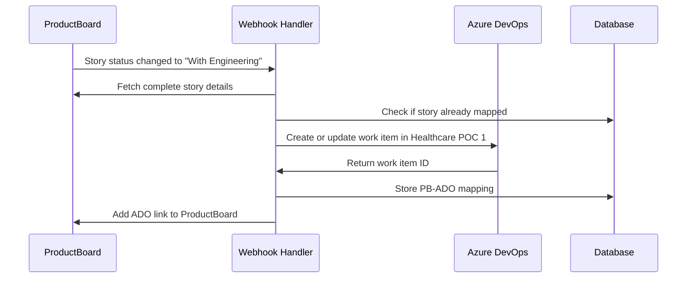

# Healthcare POC 1 - ProductBoard to Azure DevOps Integration Guide

This guide provides step-by-step instructions for setting up and testing the integration between ProductBoard and Azure DevOps for the Healthcare POC 1 project.

## Prerequisites

1. Azure DevOps account with access to the "Healthcare POC 1" project
2. ProductBoard account with necessary permissions
3. Supabase account for hosting the Edge Functions
4. Environment variables properly configured in a `.env` file

## Environment Setup

Create or update a `.env` file in the root directory with the following variables:

```env
# Azure DevOps configuration
ADO_ORG=your-organization
ADO_PROJECT=your-project-name
ADO_PAT=your-personal-access-token

# ProductBoard configuration
PB_API_TOKEN=your-productboard-api-token
PB_WEBHOOK_SECRET=your-webhook-secret

# Supabase configuration
SUPABASE_URL=your-supabase-url
SUPABASE_SERVICE_ROLE_KEY=your-service-role-key

# Integration control
ADO_SYNC_ENABLED=true
```

## Deployment Steps

1. **Deploy Supabase Edge Functions**:

   ```bash
   chmod +x scripts/deploy-pb-ado-functions.sh
   ./scripts/deploy-pb-ado-functions.sh
   ```

2. **Set up ProductBoard webhook**:
   - Go to ProductBoard > Integrations > Webhooks
   - Create a new webhook with endpoint: `https://your-supabase-url.functions.supabase.co/pb-ado-sync`
   - Select these events:
     - `feature.status.updated`
     - `feature.updated`
   - Set the secret to match your `PB_WEBHOOK_SECRET` environment variable

3. **Configure Azure DevOps area paths**:
   - Ensure the area paths in Healthcare POC 1 match your ProductBoard components
   - For example, if you have a "Frontend" component in ProductBoard, create a "Frontend" area path in Azure DevOps

## Testing the Integration

We've provided three ways to test the integration:

### 1. All-in-One Test Script

Run the comprehensive test script that tests all integration points:

```bash
chmod +x scripts/test-healthcare-poc1.sh
./scripts/test-healthcare-poc1.sh
```

This script runs all three test methods below in sequence.

### 2. Direct ADO API Testing with Bash/curl

Test creating a work item directly in Azure DevOps with curl:

```bash
chmod +x scripts/test-ado-push.sh
./scripts/test-ado-push.sh
```

### 3. Direct ADO API Testing with Node.js

Test creating a work item directly in Azure DevOps with Node.js:

```bash
node scripts/test-ado-push.js
```

### 4. Webhook Simulation Testing

Test the entire webhook flow by simulating a ProductBoard webhook event:

```bash
node scripts/test-pb-webhook.js
```

## Verification

After running the tests, verify the following:

1. Work items are created in the "Healthcare POC 1" project in Azure DevOps
2. Area paths correctly reflect the component structure (e.g., "Healthcare POC 1\Frontend")
3. The integration properly maps all fields from ProductBoard to ADO
4. The mapping records are properly stored in the database

## Troubleshooting

If you encounter issues:

1. **Check Logs**:
   - Review the terminal output from the test scripts
   - Check the Supabase Function logs in the Supabase dashboard

2. **Verify Environment Variables**:
   - Ensure all environment variables are correctly set
   - Check that ADO_PAT has sufficient permissions

3. **Inspect Database**:
   - Look at the `pb_ado_mappings` table to see if mappings are created
   - Check the `pb_ado_automation_logs` table for detailed execution logs

4. **Common Issues**:
   - 401 errors: Authentication problem with ADO or PB tokens
   - 403 errors: Permission issues
   - 404 errors: Check project names and area paths

## Field Mappings

The integration maps these fields from ProductBoard to Azure DevOps:

| ProductBoard Field | Azure DevOps Field |
|-------------------|-------------------|
| Name | System.Title |
| Description | System.Description (enhanced with HTML) |
| Component | System.AreaPath (Healthcare POC 1\\ComponentName) |
| Notes.acceptance_criteria | Microsoft.VSTS.Common.AcceptanceCriteria |
| Custom fields.effort | Microsoft.VSTS.Scheduling.StoryPoints |
| Custom fields.timeframe | Microsoft.VSTS.Scheduling.TargetDate |
| ID, Component ID, Product ID | System.Tags (as metadata) |
| Custom fields.growth_driver | Tag: GrowthDriver |
| Custom fields.tentpole | Tag: Tentpole |
| Custom fields.investment_category | Tag: Investment:Value |

## Workflow Diagram



## Post-Integration Actions

After successfully creating the integration:

1. **Monitor Usage**:
   - Check database logs to ensure mappings are working correctly
   - Verify field values are transferred accurately

2. **Gather Feedback**:
   - Ask team members using both ProductBoard and Azure DevOps for feedback
   - Make adjustments to field mappings if needed

3. **Maintain Integration**:
   - Update tokens when they expire
   - Monitor for any changes to the ProductBoard or ADO APIs
   
## Next Steps

1. **Expand to Other Projects**:
   - After successfully testing with Healthcare POC 1, consider extending to other projects
   - Copy these scripts and modify the project names as needed

2. **Enhance Automation**:
   - Add functionality to update ProductBoard when ADO status changes
   - Implement two-way synchronization

3. **Review Documentation**:
   - See `docs/PB_ADO_HEALTHCARE_POC1_INTEGRATION.md` for technical details
   - See `docs/PB_ADO_WEBHOOK_INTEGRATION.md` for general integration information
