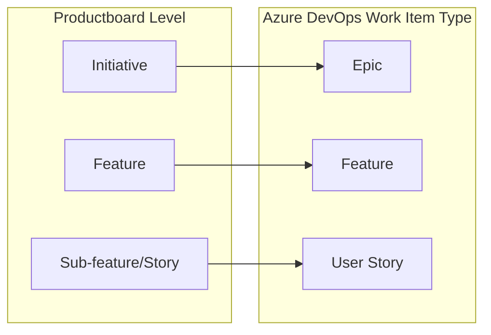
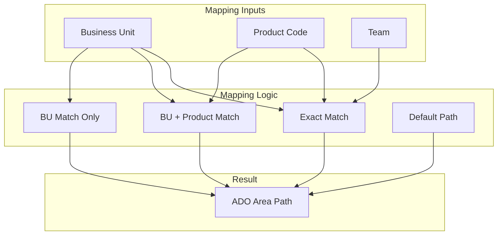
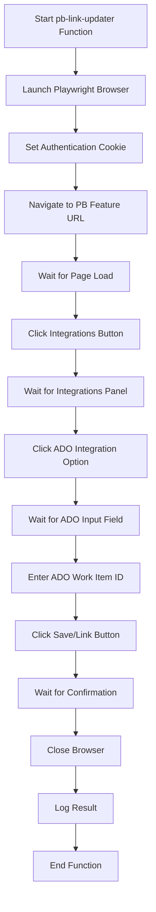

# Productboard to Azure DevOps Integration: Status-Based Synchronization

This document provides comprehensive technical documentation for the Productboard → Azure DevOps (ADO) integration that triggers when a Productboard story status changes to "With Engineering".

## Table of Contents

1. [Overview](#overview)
2. [Architecture Diagram](#architecture-diagram)
3. [Data Flow](#data-flow)
4. [Event Trigger and Webhook](#event-trigger-and-webhook)
5. [Mapping Logic](#mapping-logic)
   - [Type Mapping](#type-mapping)
   - [Area Path Mapping](#area-path-mapping)
   - [Field Mapping](#field-mapping)
6. [ADO Work Item Creation and Update](#ado-work-item-creation-and-update)
7. [Database Schema](#database-schema)
8. [Linking Back to Productboard with Playwright](#linking-back-to-productboard-with-playwright)
   - [Detailed Playwright Flow](#detailed-playwright-flow)
   - [Selector Management](#selector-management)
   - [Error Handling](#error-handling)
9. [Deployment Guide](#deployment-guide)
10. [Testing Strategy](#testing-strategy)
11. [Troubleshooting](#troubleshooting)
12. [Security Considerations](#security-considerations)
13. [Code Examples](#code-examples)
    - [Webhook Handler](#webhook-handler)
    - [Mapping Functions](#mapping-functions)
    - [Playwright Integration](#playwright-integration)

## Overview

When a Productboard (PB) story/feature is moved to "With Engineering" status, this integration:

1. Detects the status change via a webhook
2. Fetches the complete Productboard item details
3. Maps the PB data to ADO work item fields using configurable mapping rules
4. Creates or updates an ADO work item with the mapped data
5. Records the mapping between PB and ADO items in a database
6. Uses Playwright browser automation to add the ADO work item link back to the PB feature

This integration ensures that engineering work tracked in Azure DevOps remains synchronized with product requirements in Productboard.

## Architecture Diagram

```mermaid
graph TB
    subgraph "Productboard"
        PB[Productboard Feature/Story]
        STATUS[Status Changed to "With Engineering"]
    end
    
    subgraph "Webhook"
        HOOK[Productboard Webhook]
    end
    
    subgraph "Supabase Functions"
        SYNC[pb-ado-sync Edge Function]
        LINK[pb-link-updater Node.js Function]
    end
    
    subgraph "Azure DevOps"
        ADO[Azure DevOps Work Item]
    end
    
    subgraph "Database"
        MAPS[pb_ado_mappings Table]
        LOGS[pb_ado_automation_logs Table]
        CONFIG[hierarchy_mappings Table]
    end
    
    subgraph "Browser Automation"
        PLAYWRIGHT[Playwright Browser]
    end
    
    PB --> STATUS
    STATUS --> HOOK
    HOOK --> SYNC
    SYNC --> |Fetch Configuration| CONFIG
    SYNC --> |Create/Update| ADO
    SYNC --> |Record Mapping| MAPS
    SYNC --> |Log Events| LOGS
    SYNC --> |Trigger| LINK
    LINK --> PLAYWRIGHT
    PLAYWRIGHT --> |Add ADO Link| PB
```

## Data Flow

```mermaid
sequenceDiagram
    participant PB as Productboard
    participant HOOK as Webhook
    participant SYNC as pb-ado-sync
    participant DB as Database
    participant ADO as Azure DevOps
    participant LINK as pb-link-updater
    participant PLAY as Playwright
    
    PB->>HOOK: Status changed to "With Engineering"
    HOOK->>SYNC: Forward event payload
    SYNC->>SYNC: Verify webhook signature
    SYNC->>DB: Log initial receipt
    SYNC->>PB: Fetch full feature data
    SYNC->>DB: Check last known status
    
    alt Status changed to "With Engineering"
        SYNC->>DB: Fetch mapping configuration
        SYNC->>SYNC: Apply mapping logic
        
        alt Existing ADO work item
            SYNC->>ADO: Update work item with mapped fields
        else New ADO work item
            SYNC->>ADO: Create work item with mapped fields
        end
        
        ADO->>SYNC: Return work item ID and URL
        SYNC->>DB: Upsert PB-ADO mapping
        SYNC->>DB: Update status cache
        SYNC->>DB: Log success
        SYNC->>LINK: Trigger with work item data
        LINK->>PLAY: Launch browser
        PLAY->>PB: Navigate to feature
        PLAY->>PB: Open integrations panel
        PLAY->>PB: Select ADO integration
        PLAY->>PB: Enter work item ID
        PLAY->>PB: Save link
        LINK->>DB: Log linking result
    else Status didn't change to "With Engineering"
        SYNC->>DB: Update status cache
        SYNC->>DB: Log skipped
    end
    
    SYNC->>HOOK: Return success response
```

## Event Trigger and Webhook

### Webhook Configuration in Productboard

- **Events:** `feature.updated` (to capture status changes)
- **Target URL:** The deployed Supabase function URL for `pb-ado-sync`
- **Secret:** A secure, random string stored both in Productboard and as an environment variable in Supabase

### Webhook Handler

The Supabase Edge Function `pb-ado-sync` handles the webhook with the following steps:

1. **Verification:** Validates the webhook signature using the shared secret
2. **Event Parsing:** Extracts the event type and feature/story ID
3. **Logging:** Records the event receipt in `pb_ado_automation_logs`
4. **Feature Fetch:** Uses the Productboard API to get complete feature data
5. **Status Check:** Compares current status to last known status in database

**Security Considerations:**
- The webhook secret should be strong and randomly generated
- Validate the signature of every incoming webhook request
- Only process events from authorized Productboard instances

## Mapping Logic

The mapping between Productboard and Azure DevOps is configured in the `hierarchy_mappings` table and accessed through the functions in `src/lib/api/hierarchyMapping.ts`.

### Type Mapping

Productboard items are mapped to ADO work item types:



**Implementation:**
- The `getAdoTypeForPbLevel` function determines the appropriate ADO work item type based on the PB item level.
- Configurable through the `pb_to_ado_mappings` array in the `hierarchy_mappings` table

### Area Path Mapping

Area paths in ADO are determined based on:

1. Business unit (derived from initiative)
2. Product code (derived from feature)
3. Team (derived from assignee and/or component)



**Implementation:**
- The `getAreaPathForItem` function implements the cascading fallback logic shown above
- The function tries increasingly broader matches until it finds a configured area path
- Configurable through the `area_path_mappings` array in the `hierarchy_mappings` table

### Field Mapping

Fields from Productboard are mapped to ADO fields as follows:

| Azure DevOps Field      | Productboard Field                  | ADO Field Reference            |
|------------------------|-------------------------------------|-------------------------------|
| Description            | Description                         | System.Description            |
| Investment Category    | Investment Category                 | Custom.InvestmentCategory     |
| Growth Driver          | Growth Driver                       | Custom.GrowthDriver           |
| Story Points           | Engineering Assigned Story Points    | Microsoft.VSTS.Scheduling.StoryPoints |
| Acceptance Criteria    | Acceptance Criteria                 | Custom.AcceptanceCriteria     |
| Title (Required)       | Name (Required)                     | System.Title                  |
| Target Date            | Timeframe: End                      | Microsoft.VSTS.Scheduling.TargetDate |
| Assigned To            | Owner (Required)                    | System.AssignedTo             |
| Tentpole               | Tentpole                            | Custom.Tentpole               |

**Implementation Notes:**
- ADO Field Reference names may vary between organizations and should be validated
- Required fields (Title, Assigned To) must always be present in the mapping
- Some fields may require specific formatting to be accepted by ADO

## ADO Work Item Creation and Update

### API Interaction

Azure DevOps work items are created or updated through the ADO REST API:

- **Create:** `POST https://dev.azure.com/{organization}/{project}/_apis/wit/workitems/${workItemType}`
- **Update:** `PATCH https://dev.azure.com/{organization}/_apis/wit/workitems/{id}`

### JSON Patch Operations

ADO uses JSON Patch format for work item operations:

```json
[
  { "op": "add", "path": "/fields/System.Title", "value": "PB Feature Name" },
  { "op": "add", "path": "/fields/System.Description", "value": "PB Description" },
  { "op": "add", "path": "/fields/System.AreaPath", "value": "Mapped Area Path" }
]
```

For updates, the operation is typically "replace" instead of "add" for existing fields.

### Parent-Child Relationships

If the PB item has a parent, a parent-child relationship is established in ADO:

```json
[
  { "op": "add", "path": "/relations/-", "value": {
    "rel": "System.LinkTypes.Hierarchy-Reverse",
    "url": "https://dev.azure.com/{organization}/{project}/_apis/wit/workitems/{parentId}"
  }}
]
```

## Database Schema

### pb_ado_mappings Table

Stores the mapping between Productboard and Azure DevOps items:

```sql
CREATE TABLE pb_ado_mappings (
  id UUID PRIMARY KEY DEFAULT uuid_generate_v4(),
  productboard_id TEXT NOT NULL UNIQUE,
  ado_work_item_id INTEGER,
  ado_work_item_url TEXT,
  last_known_pb_status TEXT,
  last_synced_at TIMESTAMP WITH TIME ZONE,
  sync_status TEXT,
  sync_error TEXT,
  created_at TIMESTAMP WITH TIME ZONE DEFAULT NOW(),
  updated_at TIMESTAMP WITH TIME ZONE DEFAULT NOW()
);
```

### pb_ado_automation_logs Table

Records all events, successes, and errors during the synchronization process:

```sql
CREATE TABLE pb_ado_automation_logs (
  id UUID PRIMARY KEY DEFAULT uuid_generate_v4(),
  event_type TEXT,
  pb_item_id TEXT,
  pb_item_type TEXT,
  status TEXT,
  details TEXT,
  payload JSONB,
  created_at TIMESTAMP WITH TIME ZONE DEFAULT NOW()
);
```

### hierarchy_mappings Table

Stores the configuration for type, area path, and team mappings:

```sql
CREATE TABLE hierarchy_mappings (
  id UUID PRIMARY KEY DEFAULT uuid_generate_v4(),
  name TEXT NOT NULL,
  description TEXT,
  pb_to_ado_mappings JSONB,
  area_path_mappings JSONB,
  initiative_epic_mappings JSONB,
  user_team_mappings JSONB,
  component_product_mappings JSONB,
  workspace_id TEXT,
  created_at TIMESTAMP WITH TIME ZONE DEFAULT NOW(),
  updated_at TIMESTAMP WITH TIME ZONE DEFAULT NOW()
);
```

## Linking Back to Productboard with Playwright

### Detailed Playwright Flow

The `pb-link-updater` function uses Playwright for browser automation to add the ADO work item link to the Productboard feature.



### Detailed Step-by-Step Implementation

#### 1. Environment and Browser Setup

```javascript
// Import Playwright
const { chromium } = require('playwright');

// Function to add ADO link to Productboard
async function addAdoLinkToProductboard(pbFeatureUrl, adoWorkItemId, pbSessionToken) {
  // Browser setup options suitable for serverless environment
  const browser = await chromium.launch({
    headless: true,
    // Additional options for containerized/serverless environment
    args: [
      '--disable-dev-shm-usage',
      '--disable-setuid-sandbox',
      '--no-sandbox',
      '--disable-gpu'
    ]
  });
  
  let page = null;
  
  try {
    const context = await browser.newContext();
    
    // Set authentication cookies
    await context.addCookies([{
      name: 'SESSION_TOKEN_COOKIE_NAME', // Replace with actual cookie name
      value: pbSessionToken,
      domain: '.productboard.com',
      path: '/',
      httpOnly: true,
      secure: true
    }]);
    
    page = await context.newPage();
    
    // Rest of the implementation...
  }
  catch (error) {
    // Error handling...
  }
  finally {
    if (browser) {
      await browser.close();
    }
  }
}
```

#### 2. Navigation and Element Interaction

```javascript
// Inside the try block of the function above
// Navigate to feature
console.log(`Navigating to Productboard feature: ${pbFeatureUrl}`);
await page.goto(pbFeatureUrl, { 
  waitUntil: 'networkidle',
  timeout: 60000 // 60 second timeout for slow connections
});

// Wait for page to fully load - look for a reliable element
await page.waitForSelector('div[data-testid="feature-header"], h1.feature-title', {
  timeout: 30000
});

// Take screenshot to debug navigation success
await page.screenshot({ path: `screenshot_0_before_integrations_${Date.now()}.png` });

// Click Integrations button
console.log('Looking for and clicking Integrations button');
const integrationsSelector = 'button[data-testid="integrations-button"], button.integrations-btn';
await page.waitForSelector(integrationsSelector, { timeout: 30000 });
await page.click(integrationsSelector);

// Wait for integrations panel and take screenshot
await page.waitForTimeout(1000); // Small delay for animation
await page.screenshot({ path: `screenshot_1_after_integrations_click_${Date.now()}.png` });

// Look for ADO integration option
console.log('Looking for and clicking Azure DevOps integration option');
const adoOptionSelector = 'div[data-testid="ado-integration-option"], div.ado-integration';
await page.waitForSelector(adoOptionSelector, { timeout: 30000 });
await page.click(adoOptionSelector);

// Wait for ADO integration panel and take screenshot
await page.waitForTimeout(1000); // Small delay for animation
await page.screenshot({ path: `screenshot_2_after_ado_option_click_${Date.now()}.png` });

// Enter the ADO work item ID
console.log(`Entering ADO work item ID: ${adoWorkItemId}`);
const adoInputSelector = 'input[data-testid="ado-work-item-id-input"], input.ado-id-input';
await page.waitForSelector(adoInputSelector, { timeout: 30000 });
await page.fill(adoInputSelector, adoWorkItemId.toString());

// Click the "Link" or "Save" button
console.log('Clicking Save/Link button');
const saveBtnSelector = 'button[data-testid="save-ado-link"], button.save-link-btn';
await page.waitForSelector(saveBtnSelector, { timeout: 30000 });
await page.click(saveBtnSelector);

// Wait for confirmation - could be a success message or changed UI state
console.log('Waiting for confirmation');
await page.waitForTimeout(2000); // Wait for any success animations
await page.screenshot({ path: `screenshot_3_after_push_button_click_${Date.now()}.png` });
```

#### 3. Error Handling and Retry Logic

```javascript
// Enhanced error handling with retries
async function clickWithRetry(page, selector, description, maxRetries = 3) {
  for (let attempt = 1; attempt <= maxRetries; attempt++) {
    try {
      console.log(`Attempting to click ${description} (attempt ${attempt}/${maxRetries})`);
      await page.waitForSelector(selector, { timeout: 30000 });
      await page.click(selector);
      console.log(`Successfully clicked ${description}`);
      return true;
    } catch (error) {
      console.error(`Error clicking ${description} (attempt ${attempt}/${maxRetries}):`, error.message);
      
      // Take screenshot for debugging
      await page.screenshot({ path: `error_screenshot_${Date.now()}.png` });
      
      if (attempt === maxRetries) {
        throw new Error(`Failed to click ${description} after ${maxRetries} attempts: ${error.message}`);
      }
      
      // Wait before retry
      await page.waitForTimeout(2000);
    }
  }
}
```

### Selector Management

Productboard's UI selectors might change over time. To ensure maintainability:

1. Use multiple fallback selectors for each element
2. Document and version all selectors
3. Use data-testid attributes when available (more stable)
4. Take screenshots at each step for debugging
5. Implement robust error reporting

**Selector Table:**

| Element | Primary Selector | Fallback Selector | Description |
|---------|------------------|-------------------|-------------|
| Integrations Button | `button[data-testid="integrations-button"]` | `button.integrations-btn` | Button to open integrations panel |
| ADO Integration Option | `div[data-testid="ado-integration-option"]` | `div.ado-integration` | Azure DevOps integration in the panel |
| ADO Work Item ID Input | `input[data-testid="ado-work-item-id-input"]` | `input.ado-id-input` | Input field for ADO work item ID |
| Save/Link Button | `button[data-testid="save-ado-link"]` | `button.save-link-btn` | Button to save the ADO link |

### Error Handling

The Playwright script includes comprehensive error handling:

1. **Screenshots:** Automatically capture screenshots at each step and when errors occur
2. **Logging:** Detailed logging of each automation step and any errors
3. **Retries:** Retry logic for elements that might take longer to appear or be clickable
4. **Cleanup:** Always close browser resources in a finally block
5. **Reporting:** Record all errors in the `pb_ado_automation_logs` table

## Deployment Guide

### Supabase Function Deployment

1. **Prerequisites:**
   - Supabase CLI installed
   - Project initialized

2. **Deploy pb-ado-sync:**
   ```bash
   supabase functions deploy pb-ado-sync
   ```

3. **Deploy pb-link-updater:**
   ```bash
   supabase functions deploy pb-link-updater --no-verify-jwt
   ```

4. **Environment Variables:**
   Configure the following in Supabase:
   - `PB_WEBHOOK_SECRET`: Secret used to verify webhook signatures
   - `PB_API_TOKEN`: Productboard API token for fetching feature data
   - `ADO_ORG`: Azure DevOps organization name
   - `ADO_PROJECT`: Azure DevOps project name
   - `ADO_PAT`: Azure DevOps Personal Access Token
   - `SUPABASE_URL`: URL of your Supabase project
   - `SUPABASE_SERVICE_ROLE_KEY`: Service role key for database access

### Productboard Webhook Configuration

1. In Productboard, navigate to Settings > Integrations > Webhooks
2. Create a new webhook with:
   - Name: "ADO Sync"
   - URL: Your deployed `pb-ado-sync` function URL
   - Events: `feature.updated`
   - Secret: The same secret used in `PB_WEBHOOK_SECRET`
   - Format: JSON

## Testing Strategy

### Unit Testing

1. **Mapping Logic:**
   - Test `getAdoTypeForPbLevel`, `getAreaPathForItem`, etc. with various inputs
   - Verify correct mapping decisions based on configuration

2. **Field Mapping:**
   - Test extraction and formatting of Productboard fields
   - Verify construction of ADO JSON Patch operations

### Integration Testing

1. **Webhook Processing:**
   - Send mock webhook payloads to the function
   - Verify proper logging and processing

2. **ADO API Interaction:**
   - Test creation and updating of work items
   - Verify field values are correctly set

3. **Playwright Automation:**
   - Test the browser automation with different feature URLs
   - Verify proper error handling and screenshots

### End-to-End Testing

1. Change a Productboard story status to "With Engineering"
2. Verify the ADO work item is created/updated
3. Verify the ADO work item has the correct field values
4. Verify the link is added back to Productboard
5. Verify all logs and database entries

## Troubleshooting

### Common Issues and Solutions

1. **Webhook Verification Failures:**
   - Check that Productboard webhook secret matches Supabase env var
   - Ensure webhook URL is correct and accessible

2. **ADO API Errors:**
   - Verify ADO PAT has sufficient permissions
   - Check ADO organization and project names
   - Validate field reference names in your organization

3. **Playwright Automation Failures:**
   - Check screenshots for UI changes that broke selectors
   - Verify session token is valid and has permissions
   - Look for Javascript errors in the browser console

### Debugging Resources

1. **Logs:**
   - Check `pb_ado_automation_logs` table for detailed event logs
   - Review Supabase function logs for runtime errors

2. **Screenshots:**
   - Examine Playwright screenshots to identify UI issues
   - Check for errors in the UI that might not appear in logs

3. **Manual Tests:**
   - Use `scripts/link-pb-to-ado-manual.js` to test linking directly
   - Use `src/test-pb-ado-mapping.js` to test mapping logic

## Security Considerations

1. **Authentication:**
   - Store all API tokens and secrets securely in Supabase environment variables
   - Rotate tokens periodically
   - Use minimal permission scopes for all tokens

2. **Data Handling:**
   - Never log sensitive data like tokens or cookies
   - Be mindful of logging PII from Productboard or ADO
   - Clean up temporary files like screenshots

3. **Browser Automation:**
   - Run Playwright in a secure, isolated environment
   - Properly handle all cookies and authentication
   - Close browser contexts and resources to prevent leaks

## Code Examples

### Webhook Handler

Key components of the webhook handler in `pb-ado-sync`:

```javascript
// Verify webhook signature
async function verifySignature(req: Request): Promise<boolean> {
  const expectedSecret = Deno.env.get('PB_WEBHOOK_SECRET');
  if (!expectedSecret) {
    console.error('Verification Error: PB_WEBHOOK_SECRET environment variable not set.');
    return false;
  }

  const signature = req.headers.get('authorization');
  if (!signature) {
    console.warn('Verification Warning: Missing authorization header in webhook request.');
    return false;
  }

  const isValid = signature === expectedSecret;
  console.log(`Signature valid: ${isValid}`);
  return isValid;
}

// Handle status change event
if (currentStatus === "With Engineering" && lastKnownStatus !== "With Engineering") {
  console.log('Status changed TO "With Engineering". Proceeding with sync.');
  proceedWithSync = true;
  if (logEntryId) await supabase.from('pb_ado_automation_logs').update({ 
    status: 'processing_required', 
    details: `Status changed to ${currentStatus}` 
  }).eq('id', logEntryId);
} else {
  console.log(`Status condition not met (Current: ${currentStatus}, Last Known: ${lastKnownStatus}). Skipping ADO sync.`);
  if (logEntryId) await supabase.from('pb_ado_automation_logs').update({ 
    status: 'skipped_status_check', 
    details: `Current status '${currentStatus}' did not meet trigger condition.` 
  }).eq('id', logEntryId);
}
```

### Mapping Functions

Key implementation of mapping logic:

```typescript
// Get the appropriate area path for a ProductBoard item
export function getAreaPathForItem(
  businessUnit: string,
  productCode: string,
  team: string,
  mappings: HierarchyMappingConfig[]
): string {
  // Use the first mapping configuration for now
  const mapping = mappings[0];
  
  // Find the matching area path mapping - try new fields first
  const areaPathMapping = mapping.area_path_mappings.find(m => {
    if (m.mapping_type === 'epic') {
      return m.ado_business_unit === businessUnit;
    } else if (m.mapping_type === 'feature') {
      return m.ado_product === productCode;
    } else if (m.mapping_type === 'story') {
      return m.ado_team === team;
    }
    return false;
  });
  
  // If found with new fields, return the area path
  if (areaPathMapping) {
    return areaPathMapping.area_path;
  }
  
  // Legacy support - try the old fields
  const legacyMapping = mapping.area_path_mappings.find(m => 
    m.business_unit === businessUnit && 
    m.product_code === productCode && 
    m.team === team
  );
  
  // If no exact match, try to find a partial match
  if (!legacyMapping) {
    // Try matching just business unit and product code
    const partialMapping = mapping.area_path_mappings.find(m => 
      m.business_unit === businessUnit && 
      m.product_code === productCode
    );
    
    if (partialMapping) {
      return partialMapping.area_path;
    }
    
    // Try matching just business unit
    const businessUnitMapping = mapping.area_path_mappings.find(m => 
      m.business_unit === businessUnit
    );
    
    if (businessUnitMapping) {
      return businessUnitMapping.area_path;
    }
    
    // Default to the first mapping's area path
    return mapping.area_path_mappings[0]?.area_path || 'Unknown';
  }
  
  return legacyMapping.area_path;
}
```

### Playwright Integration

Complete implementation of the Playwright automation:

```javascript
const { chromium } = require('playwright');

// Main function to add ADO link to Productboard
async function addAdoLinkToProductboard(pbFeatureUrl, adoWorkItemId, pbSessionToken) {
  console.log(`Starting Playwright automation to link ADO Work Item ${adoWorkItemId} to PB Feature: ${pbFeatureUrl}`);
  let browser = null;
  let screenshots = [];

  try {
    // Launch browser with appropriate settings for the environment
    browser = await chromium.launch({
      headless: true, // Run headless in production
      args: [
        '--disable-dev-shm-usage',
        '--disable-setuid-sandbox',
        '--no-sandbox',
        '--disable-gpu'
      ]
    });

    const context = await browser.newContext({
      viewport: { width: 1280, height: 720 },
      userAgent: 'Mozilla/5.0 (Windows NT 10.0; Win64; x64) AppleWebKit/537.36 (KHTML, like Gecko) Chrome/91.0.4472.124 Safari/537.36'
    });

    // Set authentication cookie
    await context.addCookies([{
      name: 'SESSION_TOKEN_COOKIE_NAME', // Replace with actual cookie name
      value: pbSessionToken,
      domain: '.productboard.com',
      path: '/',
      httpOnly: true,
      secure: true
    }]);

    const page = await context.newPage();

    // Enable console logging from the browser
    page.on('console', msg => console.log(`Browser console: ${msg.text()}`));

    // Navigate to feature
    console.log(`Navigating to ProductBoard feature: ${pbFeatureUrl}`);
    await page.goto(pbFeatureUrl, { 
      waitUntil: 'networkidle',
      timeout: 60000 // 60 second timeout for navigation
    });

    // Wait for page to fully load - look for a reliable element that indicates page is loaded
    console.log('Waiting for feature page to load');
    await page.waitForSelector('div[data-testid="feature-header"], h1.feature-title', {
      timeout: 30000
    });

    // Take screenshot before starting interactions
    const screenshotBefore = await page.screenshot();
    const screenshotPathBefore = `screenshot_0_before_integrations_${Date.now()}.png`;
    screenshots.push({ path: screenshotPathBefore, data: screenshotBefore });
    console.log(`Took screenshot: ${screenshotPathBefore}`);

    // Click Integrations button - use retry function for reliability
    console.log('Looking for and clicking Integrations button');
    await clickWithRetry(
      page, 
      'button[data-testid="integrations-button"], button.integrations-btn',
      'Integrations button'
    );

    // Wait for integrations panel and take screenshot
    await page.waitForTimeout(1000); // Small delay for animation
    const screenshotAfterIntegrations = await page.screenshot();
    const screenshotPathAfterIntegrations = `screenshot_1_after_integrations_click_${Date.now()}.png`;
    screenshots.push({ path: screenshotPathAfterIntegrations, data: screenshotAfterIntegrations });
    console.log(`Took screenshot: ${screenshotPathAfterIntegrations}`);

    // Look for and click ADO integration option
    console.log('Looking for and clicking Azure DevOps integration option');
    await clickWithRetry(
      page, 
      'div[data-testid="ado-integration-option"], div.ado-integration',
      'ADO integration option'
    );

    // Wait for ADO integration panel and take screenshot
    await page.waitForTimeout(1000); // Small delay for animation
    const screenshotAfterAdoOption = await page.screenshot();
    const screenshotPathAfterAdoOption = `screenshot_2_after_ado_option_click_${Date.now()}.png`;
    screenshots.push({ path: screenshotPathAfterAdoOption, data: screenshotAfterAdoOption });
    console.log(`Took screenshot: ${screenshotPathAfterAdoOption}`);

    // Enter the ADO work item ID
    console.log(`Entering ADO work item ID: ${adoWorkItemId}`);
    const adoInputSelector = 'input[data-testid="ado-work-item-id-input"], input.ado-id-input';
    await page.waitForSelector(adoInputSelector, { timeout: 30000 });
    await page.fill(adoInputSelector, adoWorkItemId.toString());

    // Click the "Link" or "Save" button
    console.log('Clicking Save/Link button');
    await clickWithRetry(
      page, 
      'button[data-testid="save-ado-link"], button.save-link-btn',
      'Save/Link button'
    );

    // Wait for confirmation and take final screenshot
    console.log('Waiting for confirmation');
    await page.waitForTimeout(2000); // Wait for any success animations
    const screenshotAfterSave = await page.screenshot();
    const screenshotPathAfterSave = `screenshot_3_after_push_button_click_${Date.now()}.png`;
    screenshots.push({ path: screenshotPathAfterSave, data: screenshotAfterSave });
    console.log(`Took screenshot: ${screenshotPathAfterSave}`);

    console.log('Successfully added ADO link to Productboard feature');
    return {
      success: true,
      message: `Successfully linked ADO work item ${adoWorkItemId} to Productboard feature`,
      screenshots
    };
  } catch (error) {
    console.error('Error adding ADO link to Productboard:', error);
    
    // Take error screenshot if page is available
    if (page) {
      const errorScreenshot = await page.screenshot();
      const errorScreenshotPath = `error_screenshot_${Date.now()}.png`;
      screenshots.push({ path: errorScreenshotPath, data: errorScreenshot });
      console.log(`Took error screenshot: ${errorScreenshotPath}`);
    }
    
    return {
      success: false,
      message: `Failed to add ADO link to Productboard: ${error.message}`,
      error: error.toString(),
      screenshots
    };
  } finally {
    // Always close the browser
    if (browser) {
      console.log('Closing browser');
      await browser.close();
    }
  }
}

// Enhanced click with retry for reliability
async function clickWithRetry(page, selector, description, maxRetries = 3) {
  for (let attempt = 1; attempt <= maxRetries; attempt++) {
    try {
      console.log(`Attempting to click ${description} (attempt ${attempt}/${maxRetries})`);
      await page.waitForSelector(selector, { timeout: 30000 });
      await page.click(selector);
      console.log(`Successfully clicked ${description}`);
      return true;
    } catch (error) {
      console.error(`Error clicking ${description} (attempt ${attempt}/${maxRetries}):`, error.message);
      
      // Take screenshot for debugging
      await page.screenshot({ path: `error_screenshot_${Date.now()}.png` });
      
      if (attempt === maxRetries) {
        throw new Error(`Failed to click ${description} after ${maxRetries} attempts: ${error.message}`);
      }
      
      // Wait before retry
      await page.waitForTimeout(2000);
    }
  }
}
```

## Implementation Next Steps

The full implementation will require updates to these main components:

1. **pb-ado-sync Function:**
   - Add hierarchy mapping logic in place of hardcoded values
   - Implement complete field mapping according to the requirements
   - Enhance error handling and logging

2. **pb-link-updater Function:**
   - Update the Playwright script with robust selectors and error handling
   - Implement proper logging and screenshot management
   - Ensure proper session token handling

3. **Database:**
   - Create or update the necessary tables
   - Add indices for efficient lookups

4. **Deployment:**
   - Package and deploy the Supabase functions
   - Configure environment variables
   - Set up the Productboard webhook

## Conclusion

This detailed technical specification provides a comprehensive roadmap for implementing the Productboard → Azure DevOps integration that triggers when a story status changes to "With Engineering". The implementation leverages existing hierarchy mapping infrastructure while enhancing it with status-based triggers and Playwright-based UI automation for bidirectional linking.

The modular approach allows for future enhancements, such as supporting additional status triggers, mapping more fields, or adding more sophisticated business logic for determining area paths and work item types.
