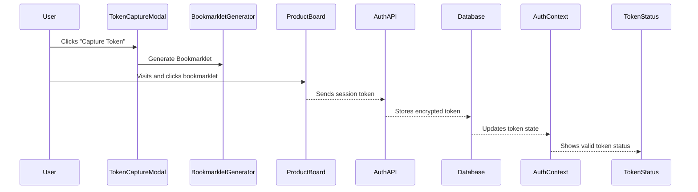

# Feature Module Architecture

This document outlines the major feature modules of the ProductBoard-ADO Integration, including their purpose, key components, and data models.

## Table of Contents

1. [Authentication & Workspace Management](#1-authentication--workspace-management)
2. [ProductBoard Hierarchy Visualization](#2-productboard-hierarchy-visualization)
3. [Feature Management](#3-feature-management)
4. [Ranking Management](#4-ranking-management)
5. [Synchronization System](#5-synchronization-system)
6. [Story & Grooming Management](#6-story--grooming-management)
7. [Reporting & Dashboards](#7-reporting--dashboards)

## 1. Authentication & Workspace Management

The authentication module manages user authentication, ProductBoard token capture and management, and workspace selection.

### 1.1 Key Features

- ProductBoard session token capture
- Token validation and refresh
- Workspace management
- User preferences

### 1.2 Core Components

```
/features/auth
  /components
    TokenCaptureModal.tsx       # UI for token capture
    TokenStatus.tsx             # Shows token expiration status
    BookmarkletGenerator.tsx    # Creates bookmarklet for token capture
    WorkspaceSelector.tsx       # Workspace dropdown selector
  
  /hooks
    useTokenCapture.ts          # Hook for token capture flow
    useTokenStatus.ts           # Hook to check token validity
    useWorkspaces.ts            # Hook for workspace management
  
  AuthContext.tsx               # Auth state provider
  api.ts                        # Auth-related API functions
```

### 1.3 Data Models

```typescript
interface User {
  id: string;
  email: string;
  name: string;
  preferences: UserPreferences;
}

interface ProductBoardToken {
  id: string;
  token: string;
  expiresAt: string;
  isValid: boolean;
  createdAt: string;
}

interface Workspace {
  id: string;
  name: string;
  pbApiKey?: string;
  adoApiKey?: string;
  pbBoardId?: string;
  adoProjectId?: string;
  adoOrganization?: string;
  syncFrequency: 'manual' | 'hourly' | 'daily' | 'weekly';
}
```

### 1.4 Interactions



## 2. ProductBoard Hierarchy Visualization

This module visualizes the ProductBoard hierarchy (objectives, initiatives, features) in various formats.

### 2.1 Key Features

- Tree view of product hierarchy
- Relationship visualization
- Interactive exploration
- Filtering and search

### 2.2 Core Components

```
/features/hierarchy
  /components
    HierarchyExplorer.tsx       # Main hierarchy view
    HierarchyTree.tsx           # Tree visualization component
    HierarchyNode.tsx           # Individual node renderer
    RelationshipView.tsx        # Shows connections between items
    HierarchyFilters.tsx        # Filter controls for hierarchy
  
  /hooks
    useHierarchyData.ts         # Hook for hierarchy data
    useHierarchyFilters.ts      # Hook for filter management
  
  /utils
    hierarchyTransformers.ts    # Data transformation utilities
```

### 2.3 Data Models

```typescript
interface HierarchyNode {
  id: string;
  name: string;
  type: 'objective' | 'initiative' | 'feature';
  status: string;
  parentId?: string;
  children?: HierarchyNode[];
  metadata: Record<string, any>;
}

interface HierarchyFilters {
  searchQuery?: string;
  types?: Array<'objective' | 'initiative' | 'feature'>;
  statuses?: string[];
  timeframe?: [Date, Date];
}
```

### 2.4 Visualization Examples

#### Tree View

```tsx
<HierarchyTree
  data={hierarchyData}
  expandedNodes={expandedNodes}
  onNodeClick={handleNodeClick}
  onNodeExpand={handleNodeExpand}
/>
```

#### Network Graph

```tsx
<RelationshipView
  nodes={nodes}
  edges={edges}
  layout="force-directed"
  highlightedNode={selectedNode}
  onNodeSelect={setSelectedNode}
/>
```

## 3. Feature Management

This module provides management and visualization of ProductBoard features.

### 3.1 Key Features

- Feature list and card views
- Detail panels for features
- Status updates
- Filtering and sorting
- Feature metadata management

### 3.2 Core Components

```
/features/features
  /components
    FeatureExplorer.tsx         # Main feature listing page
    FeatureCard.tsx             # Card view for features
    FeatureList.tsx             # List view for features
    FeatureDetailPanel.tsx      # Feature details side panel
    FeatureFilters.tsx          # Filter controls
    FeatureActions.tsx          # Action buttons for features
  
  /hooks
    useFeatures.ts              # Data fetching hook for features
    useFeatureActions.ts        # Actions like update, delete, etc.
    useFeatureFilters.ts        # Filter state management
```

### 3.3 Data Models

```typescript
interface Feature {
  id: string;
  pbId: string;
  title: string;
  description: string;
  status: string;
  priority: number;
  initiativeId?: string;
  metadata: {
    customFields: Record<string, any>;
    adoId?: string;
    adoStatus?: string;
    lastSynced?: string;
  };
  createdAt: string;
  updatedAt: string;
}

interface FeatureFilters {
  searchQuery?: string;
  status?: string[];
  initiative?: string;
  priority?: [number, number]; // Min, max
  sortBy?: keyof Feature;
  sortDirection?: 'asc' | 'desc';
}
```

### 3.4 Feature Card Example

```tsx
<FeatureCard
  feature={feature}
  onClick={() => openDetailPanel(feature.id)}
  actions={
    <>
      <Button onClick={() => updateStatus(feature.id, 'in-progress')}>
        Start
      </Button>
      <Button onClick={() => openEditModal(feature.id)}>
        Edit
      </Button>
    </>
  }
/>
```

## 4. Ranking Management

This module manages and visualizes feature rankings from ProductBoard.

### 4.1 Key Features

- Ranking visualization
- Historical ranking tracking
- Ranking comparison
- Export functionality

### 4.2 Core Components

```
/features/rankings
  /components
    RankingExplorer.tsx         # Main rankings page
    RankingList.tsx             # List view of ranked items
    RankingTimeline.tsx         # Shows ranking changes over time
    RankingComparison.tsx       # Compares rankings between periods
    RankingFilters.tsx          # Filters for rankings
  
  /hooks
    useRankings.ts              # Fetch ranking data
    useRankingHistory.ts        # Fetch historical rankings
    useRankingFilters.ts        # Filter state management
```

### 4.3 Data Models

```typescript
interface Ranking {
  id: string;
  featureId: string;
  rank: number;
  context: string; // E.g., "global", "initiative-123", etc.
  snapshotDate: string;
  previousRank?: number;
  changeDirection?: 'up' | 'down' | 'same';
}

interface RankingFilters {
  context?: string;
  dateRange?: [Date, Date];
  featureIds?: string[];
}
```

### 4.4 Ranking Visualization Example

```tsx
<RankingTimeline
  featureId={selectedFeature.id}
  dateRange={[startDate, endDate]}
  onPointClick={handleTimelinePointClick}
/>

<RankingList
  rankings={rankingsData}
  context={selectedContext}
  showChanges={true}
  onFeatureClick={handleFeatureClick}
/>
```

## 5. Synchronization System

This module manages the synchronization between ProductBoard and ADO.

### 5.1 Key Features

- Manual and scheduled sync
- Sync history tracking
- Conflict resolution
- Status monitoring

### 5.2 Core Components

```
/features/sync
  /components
    SyncDashboard.tsx           # Overview of sync status
    SyncHistory.tsx             # List of sync operations
    SyncControls.tsx            # Buttons to trigger sync
    SyncStatusBadge.tsx         # Visual indicator of sync status
    ConflictResolution.tsx      # UI for resolving conflicts
  
  /hooks
    useSyncStatus.ts            # Get current sync status
    useSyncHistory.ts           # Get sync history data
    useSyncActions.ts           # Trigger sync operations
```

### 5.3 Data Models

```typescript
type SyncStatus = 'idle' | 'in-progress' | 'completed' | 'failed';
type SyncType = 'full' | 'incremental' | 'feature-specific';
type SyncDirection = 'pb-to-ado' | 'ado-to-pb' | 'bidirectional';

interface SyncRecord {
  id: string;
  type: SyncType;
  direction: SyncDirection;
  status: SyncStatus;
  startedAt: string;
  completedAt?: string;
  itemsProcessed: number;
  itemsCreated: number;
  itemsUpdated: number;
  itemsDeleted: number;
  errors: SyncError[];
  metadata: Record<string, any>;
}

interface SyncError {
  id: string;
  syncId: string;
  entityId: string;
  entityType: string;
  errorMessage: string;
  stackTrace?: string;
  timestamp: string;
}
```

### 5.4 Sync Timeline Example

```tsx
<SyncHistory
  records={syncRecords}
  onRecordClick={showSyncDetails}
  filters={{
    status: selectedStatusFilter,
    type: selectedTypeFilter,
    dateRange: [startDate, endDate],
  }}
/>

<SyncControls
  onFullSync={handleFullSync}
  onIncrementalSync={handleIncrementalSync}
  onEntitySync={handleEntitySync}
  isSyncing={syncStatus === 'in-progress'}
/>
```

## 6. Story & Grooming Management

This module handles story management and grooming sessions.

### 6.1 Key Features

- Story listing and detail views
- Story splitting functionality
- RICE scoring
- Grooming session management
- Dependency tracking

### 6.2 Core Components

```
/features/stories
  /components
    StoryExplorer.tsx           # Main story listing page
    StoryDetail.tsx             # Story detail view
    StorySplitter.tsx           # Interface for splitting stories
    RiceScoreCalculator.tsx     # RICE scoring interface
    StoryDependencies.tsx       # Dependency visualization
  
  /hooks
    useStories.ts               # Fetch story data
    useStoryActions.ts          # Actions for stories
    useRiceScore.ts             # Calculate RICE scores
```

```
/features/grooming
  /components
    GroomingSessionList.tsx     # List of grooming sessions
    GroomingSessionDetail.tsx   # Session detail view
    GroomingSessionScheduler.tsx # Session scheduler
    StoryQueue.tsx              # Prioritized story queue for sessions
  
  /hooks
    useGroomingSessions.ts      # Fetch session data
    useGroomingActions.ts       # Session actions
```

### 6.3 Data Models

```typescript
interface Story {
  id: string;
  title: string;
  description: string;
  status: StoryStatus;
  riceScore?: {
    reach: number;
    impact: number;
    confidence: number;
    effort: number;
    total: number;
  };
  dependencies: string[]; // IDs of dependent stories
  parentStoryId?: string; // For split stories
  completionPercentage: number;
  metadata: Record<string, any>;
}

interface GroomingSession {
  id: string;
  title: string;
  scheduledFor: string;
  duration: number; // In minutes
  facilitator: string;
  attendees: string[];
  storyIds: string[];
  completedStoryIds: string[];
  notes: string;
  status: 'scheduled' | 'in-progress' | 'completed' | 'cancelled';
}
```

### 6.4 RICE Scoring Example

```tsx
<RiceScoreCalculator
  initialValues={{
    reach: 3,
    impact: 4,
    confidence: 80,
    effort: 2,
  }}
  onChange={handleRiceChange}
  onSave={saveRiceScore}
/>

<StoryDependencies
  storyId={selectedStory.id}
  dependencies={dependencies}
  onAddDependency={addDependency}
  onRemoveDependency={removeDependency}
/>
```

## 7. Reporting & Dashboards

This module provides dashboards and reporting functionality.

### 7.1 Key Features

- Overview dashboard
- Metrics and KPIs
- Status reporting
- Customizable widgets

### 7.2 Core Components

```
/features/dashboard
  /components
    Dashboard.tsx               # Main dashboard page
    MetricsWidget.tsx           # Metrics display widget
    StatusWidget.tsx            # Status overview widget
    ChartWidget.tsx             # Chart visualization widget
    ActivityFeed.tsx            # Recent activity feed
  
  /hooks
    useDashboardData.ts         # Data for dashboard widgets
    useMetrics.ts               # Calculate and fetch metrics
```

### 7.3 Data Models

```typescript
interface DashboardMetric {
  id: string;
  name: string;
  value: number;
  previousValue?: number;
  change?: number;
  changeDirection?: 'up' | 'down' | 'same';
  unit?: string;
  type: 'count' | 'percentage' | 'currency' | 'time';
}

interface ActivityItem {
  id: string;
  type: 'creation' | 'update' | 'deletion' | 'sync' | 'status-change';
  entityId: string;
  entityType: string;
  entityName: string;
  timestamp: string;
  user: string;
  details: Record<string, any>;
}
```

### 7.4 Dashboard Example

```tsx
<Dashboard>
  <DashboardRow>
    <MetricsWidget
      title="Feature Overview"
      metrics={[
        { name: 'Total Features', value: 124 },
        { name: 'Planned', value: 45 },
        { name: 'In Progress', value: 32 },
        { name: 'Completed', value: 47 },
      ]}
    />
    
    <StatusWidget
      title="Sync Status"
      status={syncStatus}
      lastSyncTime={lastSyncTime}
      itemsSynced={itemsSynced}
    />
  </DashboardRow>
  
  <DashboardRow>
    <ChartWidget
      title="Feature Completion Trend"
      type="line"
      data={completionTrendData}
    />
    
    <ActivityFeed
      title="Recent Activity"
      items={activityItems}
      maxItems={5}
    />
  </DashboardRow>
</Dashboard>
```

---

This feature module architecture provides a comprehensive blueprint for implementing the major functionality of the ProductBoard-ADO Integration. Each module follows consistent patterns, is well-isolated with clear responsibilities, and is designed for extensibility and maintainability.
